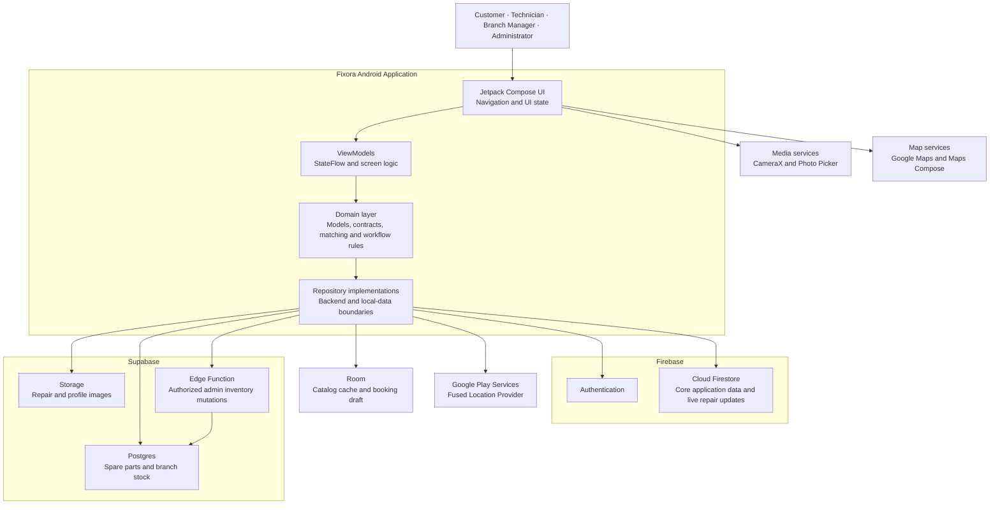

<div align="center">


# Fixora

**Smart Device Repair &amp; Service Management Platform**

A native Android application that brings customers, technicians, branch managers, and administrators
into one connected device-repair workflow — from booking a repair with photos, to availability-aware
branch matching, to live status tracking and a clearly labelled simulated payment.

<p>
  
  
  
  
  
  
  
</p>

<a href="#overview">Overview</a> ·
<a href="#demo">Demo</a> ·
<a href="#key-features">Features</a> ·
<a href="#screenshots">Screenshots</a> ·
<a href="#system-architecture">Architecture</a> ·
<a href="#tech-stack">Tech Stack</a> ·
<a href="#getting-started">Getting Started</a> ·
<a href="#project-structure">Project Structure</a> ·
<a href="#license">License</a>

</div>

---

## Overview

Device repair shops usually run on phone calls, paper job cards, and guesswork: a customer does not
know which branch can actually take the job, cannot see what stage their device is at, and staff have
no shared view of who is assigned to what. **Fixora** replaces that with a single Android application
where the whole repair lifecycle lives in one place.

A customer signs in, browses a searchable repair catalog, describes the device and fault, attaches
photos taken with the camera or picked from the gallery, and receives a **branch recommendation that
is scored on real availability** — qualified technicians and category-compatible spare-part coverage,
not just distance. After submission the repair moves along a nine-stage timeline that updates live,
finishing with a simulated (never real) payment and a receipt record.

The same application is also the staff workspace, gated by the signed-in user's Firestore role.
Technicians see only the repairs linked to their verified technician record, Branch Managers review
and assign work inside their branch, and Administrators oversee every branch — technicians,
inventory, users, and operational reports. Technically it is a layered MVVM application: Compose UI
depends on ViewModels, ViewModels depend on domain contracts, and repository implementations own the
Firebase, Supabase, Room, and location details.

## Demo

<div align="center">

### [▶ Watch Project Demo](https://drive.google.com/file/d/1uH_rHbcCkKdIlS5wtx_htcvx1uaQGra1/view?usp=sharing)

Watch the complete application demonstration to see the major features and workflow in action.
<br /><sub>Hosted on Google Drive — opens in a new tab.</sub>

</div>

## Key Features

### Customer features

- **Authentication** — email/password and Google Sign-In through Firebase Authentication, followed by Firestore-backed role routing.
- **Service discovery** — searchable, filterable repair catalog covering mobile, laptop, desktop, and tablet services.
- **Guided booking** — device category, brand, model, issue, preferred appointment, review, and submission in one structured flow.
- **Repair photos** — CameraX capture and Android Photo Picker attachments, compressed client-side and uploaded to Supabase Storage.
- **Availability-aware branch recommendation** — a domain use case scores qualified technician availability (45%), category-compatible spare-part coverage (35%), and customer distance (20%).
- **Live repair tracking** — active repairs, full history, and a real-time Firestore timeline across nine stages from Submitted to Completed, with an Awaiting Parts hold shown separately.
- **Profile management** — name, phone number, profile photo, account details, and a light/dark theme preference.
- **Offline continuity** — Room caches the service catalog and one resumable booking draft.
- **Simulated payment** — format-validated card or cash-on-pickup demo flow that writes a Firestore receipt record. No real charge is ever processed.

### Technician features

- **Scoped work queue** — technician accounts see only repairs linked to their verified Firestore technician record, searchable across active, completed, and cancelled work.
- **Appointment detail** — device, service, customer photos, appointment, branch, assignment, and current state in one view.
- **Controlled workflow** — staff may advance Received → Diagnosis → Approved → In Progress → Quality Check → Ready for Pickup; Completed is reached only by a successful customer payment.
- **Operational dashboard** — assigned, in-progress, ready, branch activity, and availability signals on a shared staff dashboard.
- **Read-only inventory** — branch spare-part levels are visible to non-administrator staff; mutations are not.

### Management &amp; administration features

- **Operations dashboard** — cross-branch repair, technician, stock, customer, and recorded demo-revenue summaries.
- **Repair monitoring** — searchable queues for new, active, completed, and cancelled requests.
- **Assignment management** — Administrators and Branch Managers confirm a branch and assign an eligible technician.
- **Technician management** — Firestore-backed creation, editing, availability, branch, skills, link-status visibility, and archive workflows for Administrators.
- **Inventory management** — Administrator-only spare-part creation, editing, availability, stock adjustment, archive, and restore, executed through a Firebase-authorized Supabase Edge Function.
- **Branch operations** — branch performance, repair volume, available technicians, and stock-attention signals.
- **User directory** — Administrator-only searchable directory with role filtering.
- **Operational reports** — filters for period, branch, device category, and technician, covering repairs and successful simulated-payment records.

### Technical highlights

- **Weighted branch-matching use case** kept in the domain layer, combining two backends plus device GPS without coupling the UI to either.
- **Role-aware navigation** — one staff screen set gated by permissions rather than three duplicated screen sets.
- **Firestore Security Rules** as the real authorization boundary, with shell scripts that exercise them.
- **Purpose-built light and dark themes** — separately tuned palettes, not an inversion, driven by centralized tokens documented in [`DESIGN_SYSTEM.md`](DESIGN_SYSTEM.md).
- **Designed loading, empty, error, and content states**, with skeletons on content-heavy screens.

## Screenshots

<table>
  <tr>
    <td align="center" width="50%">
      <br />
      <sub><strong>Customer Home</strong><br />Repair summary, service categories, primary booking action.</sub>
    </td>
    <td align="center" width="50%">
      <br />
      <sub><strong>Service Catalog</strong><br />Search, device-category filters, service imagery and pricing.</sub>
    </td>
  </tr>
  <tr>
    <td align="center" width="50%">
      <br />
      <sub><strong>Staff Dashboard</strong><br />Assigned workload, repair progress, branch activity, inventory signals.</sub>
    </td>
    <td align="center" width="50%">
      <br />
      <sub><strong>Appointment Detail</strong><br />Device information, customer evidence, branch assignment, repair status.</sub>
    </td>
  </tr>
</table>

## System Architecture

Fixora is a layered MVVM application using the repository pattern. Compose UI holds no backend
knowledge: it renders ViewModel state, ViewModels call domain contracts and use cases, and only the
repository implementations in `core/data/` know that a given piece of data lives in Firestore,
Supabase Postgres, Supabase Storage, Room, or the Fused Location Provider.



| Layer | Responsibility |
|---|---|
| **UI** (`ui/`) | Compose screens, role-aware navigation graphs, UI state and previews |
| **ViewModel** | Screen logic, `StateFlow` state exposure, coroutine scoping |
| **Domain** (`domain/`) | Models, repository contracts, branch-matching use case, technician eligibility, workflow rules |
| **Data** (`core/data/`) | Firebase, Supabase, Room and location implementations of the domain contracts |
| **Design system** (`core/designsystem/`) | Color, type, spacing, shape and theme tokens shared by every screen |

## Tech Stack

| Area | Technologies |
|---|---|
| **Language &amp; platform** | Kotlin 2.0.20, Android SDK 35 (minSdk 26), JDK 17 |
| **UI** | Jetpack Compose (BOM 2024.09), Material 3, Navigation Compose, Material Icons Extended, bundled Inter font |
| **Architecture** | Layered MVVM, repository pattern, domain use cases, Kotlin Coroutines and Flow |
| **Authentication** | Firebase Authentication (email/password + Google Sign-In via AndroidX Credential Manager and Google Identity) |
| **Cloud data** | Cloud Firestore with Security Rules and indexes |
| **Relational data &amp; media** | Supabase Postgres, Supabase Storage, Supabase Edge Function (Deno/TypeScript) |
| **Local data** | Room 2.6.1 with KSP code generation |
| **Device capabilities** | CameraX 1.3.4, Android Photo Picker, Play Services Location, Google Maps SDK + Maps Compose |
| **Networking &amp; images** | Ktor client (Android engine), Kotlinx Serialization, Supabase Kotlin SDK 3.0.0, Coil |
| **Testing** | JUnit 4, AndroidX Test (runner + ext), instrumented Firebase tests, Firestore-rules shell scripts, Node-based Edge Function tests |
| **Build tooling** | Gradle Kotlin DSL, Android Gradle Plugin 8.6.0, version catalog (`gradle/libs.versions.toml`), Google Services plugin |

## Database

Fixora deliberately splits storage across three stores, each doing what it is best at.

**Cloud Firestore — identity and live operational data.** Collections: `users`, `technicians`,
`branches`, `services`, `repairRequests`, and `payments`. `users/{uid}.role` is the authorization
field the whole application routes on; `repairRequests` is read through snapshot listeners so status
changes reach customer and staff screens in real time. Access is enforced by `firestore.rules`, with
composite indexes declared in `firestore.indexes.json`.

**Supabase Postgres — spare parts and stock.** Tables: `spare_parts`, `spare_part_stock` (per-branch
levels), `inventory_item_details`, `inventory_adjustments` (adjustment audit trail), and a
`technicians` table retained only as an untouched migration archive from before technicians moved to
Firestore. Row Level Security policies keep client access read-only; administrator mutations go
through the `inventory-admin` Edge Function.

**Room (SQLite) — offline cache.** Two entities only: `CachedServiceEntity` for the service catalog
and `DraftRepairRequestEntity` for a single resumable booking draft. There is no sync queue by
design.

Every store is reached through a domain repository contract (`ServiceRepository`,
`RepairRequestRepository`, `SparePartRepository`, `AdminInventoryRepository`, …) implemented under
`core/data/`, so screens never touch a client SDK directly.

## Project Structure

```text
.
├── app/
│   └── src/
│       ├── main/
│       │   ├── java/com/techfix/app/
│       │   │   ├── core/
│       │   │   │   ├── data/          # Firebase, Supabase, Room and location implementations
│       │   │   │   ├── designsystem/  # Color, type, spacing, shape and theme tokens
│       │   │   │   ├── navigation/    # Role-aware navigation graphs and routes
│       │   │   │   └── util/          # Image processing and diagnostics
│       │   │   ├── domain/            # Models, repository contracts and business rules
│       │   │   └── ui/
│       │   │       ├── auth/          # Login and registration
│       │   │       ├── customer/      # Catalog, booking, repairs, payment and profile
│       │   │       └── staff/         # Technician, manager and admin workspace
│       │   └── res/                   # Themes, Inter font, icons, maps and service imagery
│       ├── test/                      # JVM unit tests
│       └── androidTest/               # Instrumented and Firebase integration tests
├── Assets/                            # Logo and application screenshots
├── docs/                              # Requirements, architecture and Supabase setup SQL
├── scripts/                           # Firestore rules, migration and live verification scripts
├── supabase/
│   ├── functions/inventory-admin/     # Authorized inventory Edge Function
│   └── migrations/                    # Inventory database migration
├── releases/                          # Reviewed demonstration APK
├── firestore.rules                    # Role-aware Firestore authorization
├── firestore.indexes.json             # Firestore query indexes
└── gradle/libs.versions.toml          # Dependency version catalog
```

| Path | What lives there |
|---|---|
| `app/src/main/java/com/techfix/app/domain/` | Backend-agnostic models, contracts, and the branch-matching and eligibility rules |
| `app/src/main/java/com/techfix/app/core/data/` | The only code that knows about Firebase, Supabase, Room, and location APIs |
| `app/src/main/java/com/techfix/app/ui/` | Compose screens grouped by audience: auth, customer, staff |
| `supabase/functions/inventory-admin/` | Deno Edge Function performing privileged inventory writes after verifying a Firebase ID token |
| `scripts/` | Shell scripts that exercise Firestore rules and verify the live technician roster |

## Getting Started

### Prerequisites

- Android Studio with the Android SDK 35 platform installed
- JDK 17
- An emulator running API 26 or newer, or a physical Android device
- A Firebase project with Authentication and Cloud Firestore enabled
- A Supabase project with the required Postgres tables, Storage bucket, and the inventory Edge Function deployed
- A Google Maps API key restricted to the Android application

### 1. Clone

```bash
git clone https://github.com/mr-kumuditha/fixora-mobile-app.git
cd fixora-mobile-app
```

### 2. Configure Firebase

1. Register an Android app with the package name `com.techfix.app`.
2. Enable the email/password and Google sign-in providers.
3. Add your debug and release SHA certificate fingerprints so Google Sign-In can complete.
4. Create Cloud Firestore, then apply this repository's `firestore.rules` and `firestore.indexes.json` to your environment.
5. Download the Firebase Android client configuration and place it at `app/google-services.json`.

> `google-services.json` is an Android **client** configuration file, not an Admin SDK credential.
> Never place a Firebase Admin service-account JSON in the application or in version control.

### 3. Configure secrets

Create or update the Git-ignored `local.properties` file in the repository root:

```properties
sdk.dir=/absolute/path/to/Android/sdk
SUPABASE_URL=https://your-project.supabase.co
SUPABASE_ANON_KEY=your_publishable_or_anon_key
MAPS_API_KEY=your_restricted_android_maps_key
```

The Gradle build reads these into `BuildConfig` and the manifest at build time, so no key is ever
hardcoded in source. Enable the **Maps SDK for Android** in Google Cloud and restrict `MAPS_API_KEY`
by the `com.techfix.app` package name and your signing fingerprints.

> Never add a Supabase service-role key, Firebase Admin credential, real account password, private
> signing key, or unrestricted API key to `local.properties`, Android source, Gradle files, or
> version control.

### 4. Set up the database

- **New, disposable Supabase project:** review [`docs/supabase/schema.sql`](docs/supabase/schema.sql) before running it. It is a destructive baseline that drops and recreates tables — never run it against a populated project.
- **Existing project:** apply only the targeted changes. Inventory additions are in [`supabase/migrations/20260823193000_admin_inventory_management.sql`](supabase/migrations/20260823193000_admin_inventory_management.sql); the repair/profile image bucket policy is in [`docs/supabase/repair_images_setup.sql`](docs/supabase/repair_images_setup.sql).
- Administrator inventory mutations additionally require `supabase/functions/inventory-admin/` to be deployed, with privileged credentials stored only in the function environment.

### 5. Run

Open the repository root in Android Studio, let Gradle sync finish, select the `app` run
configuration and a device, and run. From the command line:

```bash
./gradlew assembleDebug        # build the debug APK
./gradlew installDebug         # install on a connected device
./gradlew testDebugUnitTest    # JVM unit tests
./gradlew lintDebug            # Android lint
./gradlew connectedDebugAndroidTest   # instrumented tests (device/emulator required)
```

The debug APK is written to `app/build/outputs/apk/debug/app-debug.apk`. A reviewed demonstration
build is also committed at [`releases/Fixora-v1.0-debug.apk`](releases/Fixora-v1.0-debug.apk) — a
debug build, not a production-signed Play Store release.

## How It Works

```text
Customer signs in  (Firebase Auth: email/password or Google)
        ↓
Role resolved from Firestore  users/{uid}.role
        ↓
Browse service catalog  (Firestore, cached in Room for offline reads)
        ↓
Book a repair: device, brand, model, issue, appointment
        ↓
Attach photos  (CameraX / Photo Picker → compress → Supabase Storage)
        ↓
Branch recommendation  (technicians 45% + spare-part coverage 35% + distance 20%)
        ↓
Request written to Firestore  repairRequests
        ↓
Staff confirm branch and assign an eligible technician
        ↓
Technician advances Received → Diagnosis → Approved → In Progress → Quality Check → Ready
        ↓
Customer follows the live timeline via Firestore snapshot listeners
        ↓
Simulated payment recorded  (Firestore payments) → repair marked Completed
```

## Integrations

| Service | Used for | Where |
|---|---|---|
| **Firebase Authentication** | Identity for customers and staff; email/password and Google Sign-In | `core/data/auth/` |
| **Cloud Firestore** | Users, roles, branches, services, repair requests, payments, technicians; live status updates | `core/data/` repositories |
| **Supabase Postgres** | Spare parts and per-branch stock feeding branch matching and inventory screens | `core/data/sparepart/`, `core/data/inventory/` |
| **Supabase Storage** | Repair evidence photos and profile images | `core/data/storage/` |
| **Supabase Edge Function** | Privileged administrator inventory mutations behind a Firebase token check | `supabase/functions/inventory-admin/` |
| **Google Play Services Location** | Fused Location Provider coordinates for distance scoring | `core/data/location/` |
| **Google Maps SDK / Maps Compose** | Branch map presentation | `ui/` map surfaces |
| **AndroidX Credential Manager + Google Identity** | Google Sign-In credential flow | `core/data/auth/` |

## Security

- **Authentication** is delegated entirely to Firebase; the app never stores or hashes passwords itself.
- **Authorization** is role-based: `users/{uid}.role` drives navigation, and `firestore.rules` enforces the same boundaries server-side so a compromised client cannot bypass them.
- **Least-privilege client keys** — the Android app carries only the public Supabase URL and anon key; Row Level Security keeps that key read-only, and privileged inventory writes happen inside the Edge Function.
- **Secrets stay out of the repository** — Supabase and Maps keys are injected from the Git-ignored `local.properties` at build time; service-role keys, Admin credentials, signing keys, and account lists are never committed.
- **Scoped data access** — technicians see only repairs linked to their verified technician record; Branch Managers are scoped to their branch.
- **Input validation** on registration, profile, booking, and the demo card form before anything is written.
- **Payment is simulated** and always labelled as a demo. No real charge is ever processed and no real card data is handled.

Rules behaviour is exercised by the scripts in `scripts/` and by the instrumented tests under
`app/src/androidTest/`. See [`SECURITY.md`](SECURITY.md) for the reporting policy.

## Contributors

Fixora is one Android application built by a three-member team, with ownership organized through
feature branches as documented in [`CONTRIBUTING.md`](CONTRIBUTING.md).

| Contributor | Branch | Module |
|---|---|---|
| **Kumuditha Tharinda Liyanage** ([@mr-kumuditha](https://github.com/mr-kumuditha)) | `feature/customer` | Customer module |
| **Tharusha Weerathunga** | `feature/technician` | Technician module |
| **Kavishka Peiris** | `feature/admin` | Admin module |

Changes reach `main` through reviewed pull requests after the complete application has been
verified. Read [`CONTRIBUTING.md`](CONTRIBUTING.md) before opening a change.

## Future Improvements

- [ ] Broaden automated test coverage, especially UI and end-to-end flows
- [ ] Add a CI pipeline running build, lint, and unit tests on every pull request
- [ ] Ship a production-signed release build with R8/ProGuard minification enabled
- [ ] Replace the simulated payment flow with a real payment gateway integration
- [ ] Add push notifications for repair status changes
- [ ] Extend offline support beyond the catalog cache and single draft
- [ ] Complete an accessibility pass (TalkBack labels, contrast, touch targets)
- [ ] Add dependency injection to replace manual repository wiring

## License

Distributed under the MIT License. See [`LICENSE`](LICENSE) for the full text.

## Acknowledgements

- [Jetpack Compose](https://developer.android.com/jetpack/compose) and [Material 3](https://m3.material.io/) for the UI foundation
- [Firebase](https://firebase.google.com/) for authentication and real-time data
- [Supabase](https://supabase.com/) for Postgres, Storage, and Edge Functions
- [Maps Compose](https://github.com/googlemaps/android-maps-compose), [CameraX](https://developer.android.com/training/camerax), [Coil](https://coil-kt.github.io/coil/), and [Ktor](https://ktor.io/)
- [Inter](https://rsms.me/inter/) by Rasmus Andersson, bundled as the application typeface
- Built for the NIBM HND in Software Engineering, Mobile Application Development coursework

---

<div align="center">

**Fixora** — one connected workflow for clearer repair booking, accountable service operations, and transparent progress.

<sub>Built with care and continuous learning.</sub>

</div>
