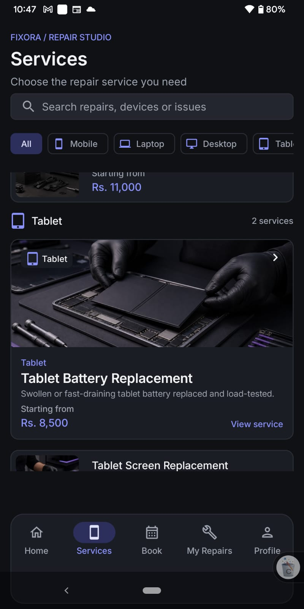
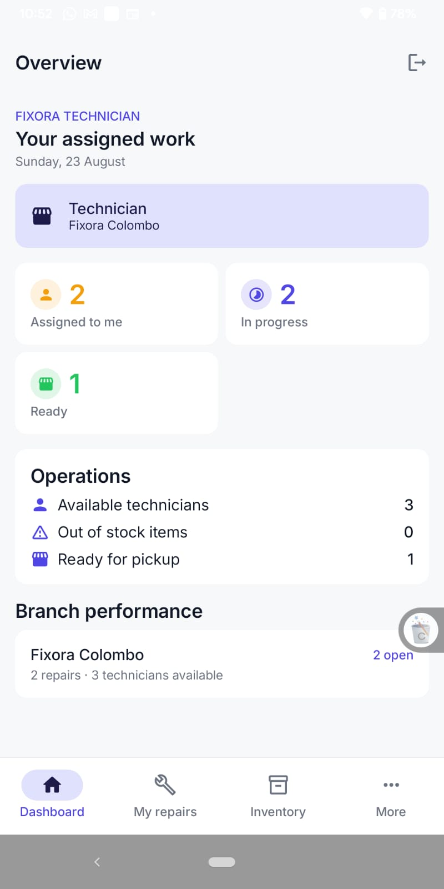
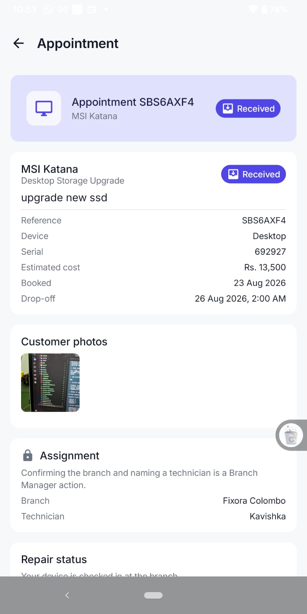

<p align="center">
  
</p>

<h1 align="center">FIXORA</h1>

<p align="center">
  <strong>Smart Device Repair &amp; Service Management Platform</strong>
</p>

<p align="center">
  A native Android application that brings customers, technicians, branch managers,<br />
  and administrators into one connected device-repair workflow.
</p>

<p align="center">
  <a href="#project-overview">Overview</a> ·
  <a href="#key-features">Features</a> ·
  <a href="#app-screenshots">Screenshots</a> ·
  <a href="#technology-stack">Technology</a> ·
  <a href="#installation">Installation</a>
</p>

---

## Project overview

Fixora is a Kotlin and Jetpack Compose application supporting the device-repair workflow across the Colombo and Galle branches. Customers can discover services, select their device, attach repair photos, receive an availability-aware branch recommendation, submit a booking, and follow its progress through a live repair timeline.

The same application provides a role-aware staff workspace. Technicians focus on repairs assigned to their linked account, Branch Managers review and assign work within their branch, and Administrators oversee cross-branch operations, technician records, inventory, users, and operational reporting.

| Area | What Fixora provides |
|---|---|
| **Repair journey** | Service discovery, guided device selection, photo-assisted booking, appointments, tracking, history, and a clearly labelled simulated payment flow |
| **Operations** | Branch recommendation, technician assignment, controlled status progression, repair queues, and branch-level visibility |
| **Cloud data** | Firebase Authentication and Cloud Firestore for identity and core application records; Supabase for spare-part stock, inventory operations, and repair/profile-image storage |
| **Offline continuity** | A Room-backed service catalog cache and one resumable local repair-request draft |

## Key features

### Customer experience

| Feature | Implementation |
|---|---|
| **Authentication** | Email/password and Google sign-in through Firebase Authentication, followed by Firestore-backed role routing |
| **Service discovery** | Searchable and filterable repair catalog covering mobile, laptop, desktop, and tablet services |
| **Guided repair booking** | Device category, brand, model, issue, preferred appointment, review, and submission in a structured flow |
| **Repair photo support** | CameraX capture and Android Photo Picker attachments with client-side compression and Supabase Storage upload |
| **Availability-aware branch recommendation** | Domain-layer scoring combines qualified technician availability (45%), category-compatible spare-part coverage (35%), and customer distance (20%) |
| **Repair visibility** | Active repairs, detailed history, and a real-time Firestore status timeline from submission to completion |
| **Profile management** | Name, phone number, profile photo, account information, and light/dark theme preference |
| **Offline support** | Cached service browsing and a single resumable booking draft through Room |
| **Demo payment** | Format-validated card or cash-on-pickup simulation with a Firestore receipt record; no real charge is processed |

### Technician workspace

| Feature | Implementation |
|---|---|
| **Assigned repair visibility** | Technician accounts see only repairs linked to their verified Firestore technician record |
| **Focused repair queue** | Searchable views for active, completed, and cancelled work relevant to the signed-in technician |
| **Appointment detail** | Device, service, customer photos, appointment, branch, assignment, and current repair state in one view |
| **Controlled workflow** | Status progression through received, diagnosis, approval, repair, quality check, and ready-for-pickup stages |
| **Operational dashboard** | Assigned, in-progress, ready, branch activity, and availability information presented through a shared staff dashboard |
| **Inventory visibility** | Branch spare-part information is presented read-only to non-administrator staff; inventory mutations are reserved for Administrators |

### Administration

| Feature | Implementation |
|---|---|
| **Operations dashboard** | Cross-branch repair, technician, stock, customer, and recorded demo-revenue summaries |
| **Repair monitoring** | Searchable queues for new, active, completed, and cancelled repair requests |
| **Assignment management** | Administrators and Branch Managers can confirm a branch and assign an eligible technician |
| **Technician management** | Firestore-backed creation, editing, availability, branch, skill, link-status visibility, and archive workflows for Administrators; account associations are provisioned outside this screen |
| **Inventory management** | Administrator-only spare-part creation, editing, availability, stock adjustment, archive, and restore through a Firebase-authorized Supabase Edge Function |
| **Branch operations** | Branch performance, repair volume, available technicians, and stock-attention information |
| **User directory** | Administrator-only searchable directory with role filtering; application roles are displayed but are not edited from this screen |
| **Operational reports** | Filters for period, branch, device category, and technician, including repairs and successful simulated-payment records |

## App screenshots

The gallery uses the application captures stored in this repository without renamed or generated replacements.

### Customer experience

<table>
  <tr>
    <td align="center" width="50%">
      <br />
      <sub><strong>Customer home</strong><br />Repair summary, service categories, and the primary booking action.</sub>
    </td>
    <td align="center" width="50%">
      <br />
      <sub><strong>Service catalog</strong><br />Search, device-category filters, service imagery, and pricing.</sub>
    </td>
  </tr>
</table>

### Staff operations

<table>
  <tr>
    <td align="center" width="50%">
      <br />
      <sub><strong>Technician overview</strong><br />Assigned workload, repair progress, branch activity, and inventory signals.</sub>
    </td>
    <td align="center" width="50%">
      <br />
      <sub><strong>Appointment detail</strong><br />Device information, customer evidence, branch assignment, and repair status.</sub>
    </td>
  </tr>
</table>

## User roles

Fixora uses Firebase Authentication for identity and validates the `users/{uid}.role` Firestore field for application authorization and routing.

| Role | Access and responsibilities |
|---|---|
| **Customer** | Browses services, creates and resumes repair bookings, uploads photos, receives branch recommendations, tracks personal repairs, views history, manages a profile, and completes the simulated payment flow |
| **Technician** | Uses a verified technician-account link to view assigned repairs, inspect appointment details, and advance permitted workflow stages; cannot assign technicians or mutate inventory |
| **Branch Manager** | Works within an assigned branch, reviews appointment queues, confirms branch placement, assigns eligible technicians, and advances permitted repair stages; inventory remains read-only |
| **Administrator** | Sees all branches and can manage assignments, the Firestore technician roster, Supabase inventory operations, branch performance, the user directory, and reports |

## Technology stack

| Category | Technologies |
|---|---|
| **Mobile** | Kotlin, Android SDK 35, Jetpack Compose, Material Design 3, Navigation Compose |
| **Architecture** | Layered MVVM, repository pattern, presentation/domain/data separation, domain use cases, Kotlin Coroutines and Flow |
| **Authentication** | Firebase Authentication with email/password and Google Sign-In through Android Credential Manager |
| **Core cloud data** | Cloud Firestore for users, roles, branches, services, repair requests, payments, and technicians; Firestore Security Rules and indexes |
| **Inventory and media** | Supabase Postgres for spare parts and per-branch stock, Supabase Storage for repair and profile images, and an administrator inventory Edge Function |
| **Local data** | Room for the service catalog cache and one draft repair request; KSP for Room code generation |
| **Device capabilities** | CameraX, Android Photo Picker, Google Play Services Location, Google Maps, and Maps Compose |
| **Networking and media** | Ktor, Kotlin Serialization, Supabase Kotlin SDK, and Coil |
| **Testing** | JUnit, AndroidX Test, Firebase emulator/rules scripts, and repository/domain test coverage |

## Design system

Fixora follows a restrained visual language designed to feel technical, trustworthy, and polished in both light and dark environments. [`DESIGN_SYSTEM.md`](DESIGN_SYSTEM.md) is the design authority; application tokens remain centralized under `core/designsystem/`.

| Element | Fixora direction |
|---|---|
| **Brand color** | Indigo primary (`#4F46E5` light, `#8B93FF` dark) for identity, selection, and primary navigation |
| **Action color** | Warm orange (`#FF7A45` light, `#FF9466` dark) reserved for the next important action |
| **Themes** | Purpose-built light and dark palettes with separate backgrounds, surfaces, borders, text, and semantic status colors |
| **Typography** | Bundled Inter variable font with a focused Display, Title, Body, and Label hierarchy |
| **Spacing and shape** | 8dp grid with 12dp cards, 8dp inputs/buttons, and 20dp sheets/dialogs |
| **Iconography** | The design authority specifies Material Symbols Rounded; the current Compose implementation uses AndroidX Material Icons Extended, with `Icons.Rounded` and `Icons.Outlined` paired for selected/inactive navigation states |
| **Motion** | Current navigation uses 200ms fades, with restrained crossfades, 120–280ms interaction/status transitions, 0.96× press feedback, and longer repeating cycles only for skeleton loading effects |
| **States** | Designed loading, empty, error, and content states, with skeletons for content-heavy screens |

## Application architecture


The UI depends on ViewModels, ViewModels depend on domain contracts, and repository implementations own the backend details. The branch-matching use case remains in the domain layer and combines Firestore technician availability, Supabase stock, and device location without coupling the UI to either backend.

## Project structure

```text
.
├── app/
│   └── src/
│       ├── main/
│       │   ├── java/com/techfix/app/
│       │   │   ├── core/
│       │   │   │   ├── data/          # Firebase, Supabase, Room and location implementations
│       │   │   │   ├── designsystem/  # Color, type, spacing, shape and theme tokens
│       │   │   │   ├── navigation/    # Role-aware navigation graphs and routes
│       │   │   │   └── util/          # Image processing and diagnostics
│       │   │   ├── domain/             # Models, repository contracts and business rules
│       │   │   └── ui/
│       │   │       ├── auth/           # Login and registration
│       │   │       ├── customer/       # Catalog, booking, repairs, payment and profile
│       │   │       └── staff/          # Technician, manager and admin workspace
│       │   └── res/                     # Themes, Inter font, icons, maps and service imagery
│       ├── test/                         # JVM tests
│       └── androidTest/                  # Instrumented and Firebase integration tests
├── Assets/                               # Repository logo and application screenshots
├── docs/                                 # Requirements, architecture and Supabase setup SQL
├── scripts/                              # Firebase rules, migration and live verification tools
├── supabase/
│   ├── functions/inventory-admin/        # Authorized inventory Edge Function
│   └── migrations/                       # Inventory database migration
├── firestore.rules                       # Role-aware Firestore authorization
├── firestore.indexes.json                # Firestore query indexes
└── releases/                              # Reviewed demonstration APK
```

## Installation

### Prerequisites

- Android Studio with Android SDK 35
- JDK 17
- An Android emulator running API 26 or newer, or a compatible physical device
- A Firebase project with Authentication and Cloud Firestore configured
- A Supabase project with the required Postgres tables, Storage bucket, and inventory function
- A Google Maps API key restricted to the Android application

### 1. Clone the repository

```bash
git clone https://github.com/mr-kumuditha/fixora-mobile-app.git
cd fixora-mobile-app
```

### 2. Configure Firebase

1. Register an Android application using the package name `com.techfix.app`.
2. Enable the required Firebase Authentication providers: email/password and Google.
3. Register the appropriate debug/release SHA certificate fingerprints in Firebase so Google Sign-In can complete on your builds.
4. Create Cloud Firestore and apply the repository's rules and indexes for your environment.
5. Download your Firebase Android client configuration and place it at:

```text
app/google-services.json
```

`google-services.json` is an Android client configuration file, not an Admin SDK credential. This repository intentionally does not ignore that path. Contributors should not commit a replacement from a private Firebase environment unless the maintainers explicitly intend to update the shared client configuration. Never place a Firebase Admin service account JSON in the application or repository.

### 3. Configure Supabase and local properties

Create or update the Git-ignored `local.properties` file in the repository root:

```properties
sdk.dir=/absolute/path/to/Android/sdk
SUPABASE_URL=https://your-project.supabase.co
SUPABASE_ANON_KEY=your_publishable_or_anon_key
MAPS_API_KEY=your_restricted_android_maps_key
```

Choose the Supabase setup path deliberately:

- For a **new disposable project**, review [`docs/supabase/schema.sql`](docs/supabase/schema.sql) before running it. It is a destructive baseline script that drops and recreates tables and includes the historical technician archive; never run it against a populated project.
- For an **existing project**, preserve current data and apply only the reviewed, targeted changes required by that environment. The current inventory additions are defined in [`supabase/migrations/20260823193000_admin_inventory_management.sql`](supabase/migrations/20260823193000_admin_inventory_management.sql), while the active repair/profile-image bucket policy is defined in [`docs/supabase/repair_images_setup.sql`](docs/supabase/repair_images_setup.sql).

Administrator inventory mutations also require the `supabase/functions/inventory-admin/` function to be deployed with privileged credentials stored only in the function environment.

Enable the **Maps SDK for Android** in Google Cloud and restrict `MAPS_API_KEY` by the `com.techfix.app` package name and the signing certificate fingerprints used by your builds.

> Never add a Supabase service-role key, Firebase Admin credential, real account password, private signing key, or unrestricted API key to `local.properties`, Android source, Gradle files, or version control.

### 4. Sync and run

1. Open the repository root in Android Studio.
2. Allow Gradle sync to complete.
3. Select the `app` run configuration.
4. Choose an emulator or physical Android device.
5. Run the application.

## Build & run

Build the debug APK:

```bash
./gradlew assembleDebug
```

Run JVM unit tests:

```bash
./gradlew testDebugUnitTest
```

Run Android lint:

```bash
./gradlew lintDebug
```

Build the instrumented-test APK:

```bash
./gradlew assembleDebugAndroidTest
```

Run instrumented tests on a connected emulator or device:

```bash
./gradlew connectedDebugAndroidTest
```

Install the debug build on a connected device:

```bash
./gradlew installDebug
```

The generated debug APK is written to:

```text
app/build/outputs/apk/debug/app-debug.apk
```

A reviewed coursework/demo artifact is also available at [`releases/Fixora-v1.0-debug.apk`](releases/Fixora-v1.0-debug.apk). It is a debug build, not a production-signed Play Store release.

Some instrumented, Firebase-rules, backend, camera, location, and upload checks require a configured emulator, a connected device, or local test credentials. Verification should state clearly which of those environments were used.

## Security boundaries

- Firebase Authentication owns user identity; Firestore roles and Security Rules control application permissions.
- Technicians are managed in Firestore. The historical Supabase technician rows are migration archives and are not the runtime technician source.
- The Android client uses only the public Supabase URL and publishable/anon key for parts/stock reads and repair/profile-image uploads; privileged inventory mutations remain inside the deployed Edge Function.
- Payment is simulated and must never be presented as a real charge.
- Local properties, account lists, service-account files, signing credentials, and environment secrets must remain outside version control.

## Contributing

Fixora is maintained as one Android application with customer, technician, and administration responsibilities developed through focused branches. Review [`CONTRIBUTING.md`](CONTRIBUTING.md) before opening a change, keep commits scoped, and report build, test, and device verification honestly.

---

<p align="center">
  <strong>Fixora</strong><br />
  One connected workflow for clearer repair booking, accountable service operations, and transparent progress.
</p>
